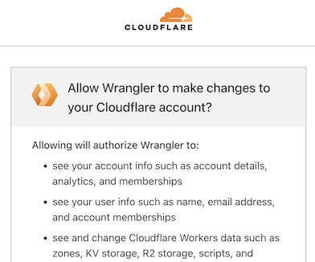
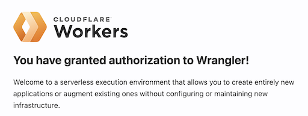

# Cloudflare Labs

A testing ground for any CloudFlare technologies.

>Note!
>
>**None of the features may persist. These are only experiments to see how things work.**

## Pre-reading

- [Cloudflare Pages](https://developers.cloudflare.com/pages/) (Cloudflare docs)
   - read them all; or know the context otherwise

<!--
- Workers > [Wrangler](https://developers.cloudflare.com/workers/wrangler/) 
-->

## Requirements

Intended to be used with:

- the [`web-cf`](https://github.com/akauppi/mp/tree/main/web%2Bcf) Multipass VM

The image contains:

- `node` and `npm`
- `wrangler` CLI


<!--developed on:

- macOS 14.5
- Multipass 1.14.0-rc1
-->

## Prepare

### Mount the work folder

On the host:

```
$ mp stop web-cf
$ mount --type=native {path-to-Lab} web-cf:/home/ubuntu/Lab
$ mp shell web-cf
```

Then, in the VM:

```
$ cd Lab/abc		# tbd. abc is temporary
$ npm install
```

<!-- REMOVE #later; not this way!
```
$ npm run dev
...
  VITE v5.2.12  ready in 9708 ms

  ➜  Local:   http://localhost:5173/
  ➜  Network: http://192.168.64.102:5173/
  ➜  press h + enter to show help
```

Here, the actual IP always works *(hint: Cmd-double click it on Mac)*.

>Hint: If you want also `localhost:5173` to work like the development happened indeed on the host (which it doesn't), run `./port-fwd.sh` (asks for `sudo` pw). [Multipass does not have built-in port forwarding](https://github.com/canonical/multipass/issues/309) - otherwise we'd use it, instead.
-->


## Local development

### `wrangler login`

First, pass the port 8976 from VM to the host (so your browser will find it).

```
$ {path-to-mp}/web+cf/login-fwd.sh 
*
* Going to forward the port '192.168.64.105:8976' as 'localhost:8976' so the dance can begin.
*
* This will require a 'sudo' pw next.
*
Press a key to continue...
Password:
Warning: Permanently added '192.168.64.105' (ED25519) to the list of known hosts.
*
* Port is now forwarded.
* Please
*   - run 'wrangler login --browser=false' in the VM
*   - open the provided link in a browser you use with Cloudflare
*   - sign in
*
* Once the CLI is happy (you may try 'wrangler whoami'), press a key and we'll close the port forward.
*
Press a key once login dance is over...
```

Within the VM:

```
$ wrangler login --browser=false

 ⛅️ wrangler 3.60.2
-------------------

Attempting to login via OAuth...
Visit this link to authenticate: https://dash.cloudflare.com/oauth2/auth?response_type=code&client_id=54d11594-...
```

- Open the link (hint: to open in macOS default browser, `Cmd-double-click` it)

- In the browser:

   - Read and press `Allow`:

   >
   
   >

`wrangler` CLI is now connected to the cloud.

Press a key on the host, to close the port forward.

>Note: If the `wrangler login` times out, just try again!


## Run

```
$ wrangler pages dev --ip 0.0.0.0 .

 ⛅️ wrangler 3.60.3
-------------------

✨ Compiled Worker successfully
[wrangler:inf] Ready on http://0.0.0.0:8788
[wrangler:inf] - http://127.0.0.1:8788
[wrangler:inf] - http://192.168.64.105:8788
⎔ Starting local server...
╭─────────────────────────────────────────────────────────────────────────────╮
│ [b] open a browser, [d] open Devtools, [c] clear console, [x] to exit
╰─────────────────────────────────────────────────────────────────────────────╯
```

You can reach the development output at the provided `http://192.168.64.105:8788` URL (macOS: highlight the link and try `Cmd-double-click`).


### Getting `localhost:8788` (optional)

If you want to access the local development as `localhost`, forward the port.

On host:

```
$ ./port-fwd.sh 
*
* Going to forward the port '192.168.64.105:8788' as 'localhost:8788'.
*
* This will require a 'sudo' pw next, to read a Multipass ssh key.
*
Press a key to continue...
Password:

Sharing port 8788. KEEP THIS TERMINAL RUNNING.

Press a key to stop the sharing.
Warning: Permanently added '192.168.64.105' (ED25519) to the list of known hosts.
```

>Note! 
>If you would like Multipass to offer port sharing built in, chime in [here](https://github.com/canonical/multipass/issues/309).
>
>Multipass does not provide port sharing because they don't regard it to be an important use case. Sure, it can be done manually but the tedious bit is having to leave the script running like that.


### Exercise URLs

Below are some paths you can try out.

|path|source|output|
|---|---|---|
|[`/`](http://localhost:8788/)|`/src/app.html`|<font color=red>DOES NOT WORK. Wrangler does not play ball with Vite `npm run dev`. ⛔️</font>|
|[`/abc`](http://localhost:8788/abc)|`/functions/abc.js`|"`Hello from ABC!`"|
|||

<!-- tbd. more -->


## 🚧🚧 Web content 🚧🚧🚧

Ideally, Wrangler would be(come) integrated with Vite so that just running `wrangler pages dev` would keep hot-module-reloading Vite page creation happening, in the same `:8788` as the surrounding `/functions` and other Cloudflare specific things.

This would be... easy for the developers.

Until that is the case, we need to *separately run `npm run dev`*. This reflects the knowledge of the author. Please see `[1]` for more info and participate in the discussion!

```
$ npm run dev

> abc@0.0.1 dev
> vite dev

4:55:52 PM [vite-plugin-svelte] You are using Svelte 5.0.0-next.153. Svelte 5 support is experimental, breaking changes can occur in any release until this notice is removed.
work in progress:
 - svelte-inspector is disabled until dev mode implements node to code mapping


  VITE v5.2.13  ready in 12909 ms

  ➜  Local:   http://localhost:5173/
  ➜  Network: http://192.168.64.105:5173/
  ➜  press h + enter to show help
```

You can use the `http://192.168.64.105:5173` URL directly. If you wish `localhost` to work, book (yet another) terminal and run `PORT=5173 ./port-forward.sh`!


>Note: Cloudflare tools are way more tuned to deployment and production than development. This is also understandable - there are so many different ways of baking web sites "out there". The situation with SvelteKit + Cloudflare Pages DX can (only?) improve!!!
		

## Deployment

Deploying with Cloudflare Pages is simple. Just tie your GitHub account with the service, create a new Pages deployment.

- Build command: `npm run build`
- Root directory: `abc`

In addition, ESLint 9 [requires Node.js >= 18.18.0](https://eslint.org/blog/2024/04/eslint-v9.0.0-released/#node.js-%3C-v18.18.0%2C-v19-no-longer-supported) so:

- `Settings` > `Environment variables`

      >
      
   - and same for `Preview`

Now, your pages get deployed to an URL like `https://lab-4hl.pages.dev` at each new push to `main` (where the build succeeds).


## References

- Cloudflare docs
   - Workers > Testing > [Local development](https://developers.cloudflare.com/workers/testing/local-development/)

- `[1]`: ["How to run SvelteKit & Cloudflare Page locally?"](https://stackoverflow.com/questions/74904528/how-to-run-sveltekit-cloudflare-page-locally) (StackOverflow)

   - [ ] Track

