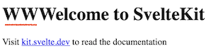
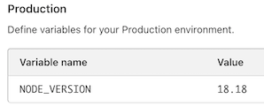

# Cloudflare Labs

A testing ground for [CloudFlare Pages](https://pages.cloudflare.com/). 

We use [SvelteKit](https://kit.svelte.dev/) as the "full stack" framework.

>Note:
>**None of the features may persist. These are only experiments to see how things work.**

## Pre-reading

- [Cloudflare Pages](https://developers.cloudflare.com/pages/) (Cloudflare docs)

	These are important! It's a lot of reading, but we expect you to know this stuff.
	
- ["Blazing fast development with full-stack frameworks and Cloudflare"](https://blog.cloudflare.com/blazing-fast-development-with-full-stack-frameworks-and-cloudflare) (blog; Apr'24)

	Since April 2024, the approach of server-side functions with regard to Cloudflare Pages has changed: they are now rolled out in the "most natural way possible" for any supported web framework.
	
	This is GREAT NEWS!  It means you can develop *as normal* with SvelteKit, including `npm run dev` that **just works** - even with locally simulated backend services.
	
	The new approach means that **`functions/` folder is now ignored**. You don't define back-end features through there; it's ignored. Some (quite a few!) places in the Cloudflare Pages still don't reflect this, and the reading / learning path may be confusing, because of this! Obviously, the docs will eventually pick up, but at the moment, this is how it is. As a whole, it's a very nice move that helps make development way simpler.

Also [SvelteKit](https://kit.svelte.dev/) knowledge is expected. You can probably "wing it" (i.e. understand by reading) if you have experience from other full stack frameworks. Just that this repo is not about teaching SvelteKit.


## Requirements

Developed with:

- the [`web-cf`](https://github.com/akauppi/mp/tree/main/web%2Bcf) Multipass VM

	- Create the VM before proceeding.	
	- Mount this folder in it as `~/Lab`.

	>Note: Using Multipass introduces some hurdles, with regard to file mapping and port forwarding. These are covered in the docs below.
	>
	>You can also follow this repo without a VM backend, but this exposes your main account more than the author is comfortable with. It's your call, though.

You'll need a Cloudflare account (free is okay) if you wish to deploy the resulting pages.

<!--developed on:

- macOS 14.5
- Multipass 1.14.0-rc1
-->


## Prepare

<!-- DEV NOTE: When doing these steps, make sure `wrangler` is not logged in: `$ wrangler logout; wrangler whoami`
-->

*Commands below happen in the VM, unless otherwise stated.*

```
$ cd Lab/def
```

We don't initially need a connection to Cloudflare. Check that you are not logged in:

```
$ wrangler logout

 ⛅️ wrangler 3.61.0
-------------------

Not logged in, exiting...
```

Install dependencies:

```
$ npm install
```

## Steps

We will try:

- Local development (`npm run dev`) with hot-module-reload
- Local preview mode (`npm run preview`)
- Deployment (`npm run deploy`)

## Local development

```
$ npm run dev

> def@0.0.1 dev
> vite dev


  VITE v5.3.1  ready in 17244 ms

  ➜  Local:   http://localhost:5173/
  ➜  Network: http://192.168.64.105:5173/
  ➜  press h + enter to show help
```

- Open the said `http://192.168.64.105:5173` URL. Do you see a web page?

	>Note: The direct VM IP works as such. If you want to use the `localhost` URL,
	>you'll need to forward it from the VM to your host:
	>
	>```
	>$ PORT=5173 ./port-fwd.sh
	>```
	>
	>Keep that terminal running.

### Hot module reload

Now, edit `def/src/routes/+page.svelte` in an IDE. Save the change.

Did you see the change?

Hot module reload means that you should not need to refresh the browser. Changes will be reflected automatically.

>

### Server-side functions

Keep the service running. Open `http://192.168.64.105:5173/abc`

>This should show , defined in `src/routes/abc/+server.js`.

- Edit the said file, changing the text. 

	Now you need to refresh the browser, since the text is not static web content but created anew for each request hitting that server-side function. Do you see the change?


<!-- tbd.
#### KV


#### Durable Objects
-->

<!-- tbd. review & complete (with UI excercising D1, some query)
### Something D1

#### Necessary preparation

Before we can use D1 (Cloudflare SQL database), we need to move the `.wrangler/state` path away from the mounted folder. D1 simulation wouldn't work on a mounted network folder.

>Also, wrangler 3 doesn't seem to have a setting so that we could point it to a safe partition, declaratively.


- Stop the `npm run dev` (ctrl-c)

   ```
   $ mv .wranger/state ~/.wrangler/def/state   # or anywhere you like within the VM; perhaps /tmp?
   $ (cd .wrangler && ln -s ~/.wrangler/def/state state)
   ```

---

- Create a database by:

   ```
   $ wrangler d1 execute lab-db --local --file schema.sql
	```

	If that doesn't give an error, you can proceed.

<!_-- Output:
	⛅️ wrangler 3.60.3
-------------------

🌀 Executing on local database lab-db (xxxxxxxx-xxxx-xxxx-xxxx-xxxxxxxxxxxx) from .wrangler/state/v3/d1:
🌀 To execute on your remote database, add a --remote flag to your wrangler command.
--_>

- Start again `npm run dev`

*tbd. How to interact with the D1*
-->

### Summary

We have exercised:

||type of endpoint|source|
|---|---|---|
|[/](http://localhost)|static web app|`src/routes/+page.svelte`|
|[/abc](http://localhost/abc)|server-side function|`src/routes/abc/+server.js`|
||


	
## Preview

```
$ npm run preview
```

<details><summary>Full output</summary>

```
> def@0.0.1 preview
> npm run build && wrangler pages dev


> def@0.0.1 build
> vite build

vite v5.3.1 building SSR bundle for production...
✓ 80 modules transformed.
vite v5.3.1 building for production...
✓ 61 modules transformed.
.svelte-kit/output/client/_app/version.json                             0.03 kB │ gzip:  0.05 kB
.svelte-kit/output/client/.vite/manifest.json                           2.25 kB │ gzip:  0.44 kB
.svelte-kit/output/client/_app/immutable/entry/start.BLK7p4ea.js        0.07 kB │ gzip:  0.08 kB
.svelte-kit/output/client/_app/immutable/nodes/0.V07vbrzA.js            0.60 kB │ gzip:  0.39 kB
.svelte-kit/output/client/_app/immutable/nodes/2.DMGK622K.js            0.69 kB │ gzip:  0.45 kB
.svelte-kit/output/client/_app/immutable/nodes/1.CD-OFZ1L.js            1.02 kB │ gzip:  0.60 kB
.svelte-kit/output/client/_app/immutable/chunks/scheduler.BvLojk_z.js   2.16 kB │ gzip:  1.02 kB
.svelte-kit/output/client/_app/immutable/chunks/index.DFTQtrJW.js       5.43 kB │ gzip:  2.30 kB
.svelte-kit/output/client/_app/immutable/entry/app.Dux3DZJ_.js          6.02 kB │ gzip:  2.44 kB
.svelte-kit/output/client/_app/immutable/chunks/entry.DCbjbte4.js      27.41 kB │ gzip: 10.82 kB
✓ built in 1.99s
Using vars defined in .dev.vars
Using vars defined in .dev.vars
.svelte-kit/output/server/.vite/manifest.json                  1.96 kB
.svelte-kit/output/server/entries/endpoints/abc/_server.js     0.12 kB
.svelte-kit/output/server/entries/fallbacks/layout.svelte.js   0.24 kB
.svelte-kit/output/server/internal.js                          0.31 kB
.svelte-kit/output/server/entries/pages/_page.svelte.js        0.37 kB
.svelte-kit/output/server/chunks/index.js                      0.83 kB
.svelte-kit/output/server/entries/fallbacks/error.svelte.js    1.18 kB
.svelte-kit/output/server/chunks/ssr.js                        3.34 kB
.svelte-kit/output/server/chunks/exports.js                    5.94 kB
.svelte-kit/output/server/chunks/internal.js                   6.00 kB
.svelte-kit/output/server/index.js                            92.33 kB
✓ built in 26.70s

Run npm run preview to preview your production build locally.

> Using @sveltejs/adapter-cloudflare
  ✔ done

 ⛅️ wrangler 3.60.3 (update available 3.61.0)
-------------------------------------------------------

✨ Compiled Worker successfully
Using vars defined in .dev.vars
Your worker has access to the following bindings:
- D1 Databases:
  - DB: lab-db (xxxxxxxx-xxxx-xxxx-xxxx-xxxxxxxxxxxx)
- Vars:
  - SECRET_KEY: "(hidden)"
[wrangler:inf] Ready on http://0.0.0.0:8788
[wrangler:inf] - http://127.0.0.1:8788
[wrangler:inf] - http://192.168.64.105:8788
⎔ Starting local server...
✨ Parsed 2 valid header rules.
[wrangler:inf] GET / 200 OK (197ms)
[wrangler:inf] GET /_app/immutable/entry/start.BLK7p4ea.js 200 OK (164ms)
[wrangler:inf] GET /_app/immutable/chunks/scheduler.BvLojk_z.js 200 OK (262ms)
[wrangler:inf] GET /_app/immutable/chunks/index.DFTQtrJW.js 200 OK (300ms)
[wrangler:inf] GET /_app/immutable/nodes/1.CD-OFZ1L.js 200 OK (160ms)
[wrangler:inf] GET /_app/immutable/chunks/entry.DCbjbte4.js 200 OK (194ms)
[wrangler:inf] GET /_app/immutable/entry/app.Dux3DZJ_.js 200 OK (99ms)
[wrangler:inf] GET /_app/immutable/nodes/0.V07vbrzA.js 200 OK (404ms)
[wrangler:inf] GET /favicon.png 200 OK (159ms)
[wrangler:inf] GET /_app/immutable/nodes/2.DMGK622K.js 200 OK (536ms)
╭──────────────────────────────────────────────────────────────────────────────────────────────────────────────────────────────────────────────────────────────────────────────────────────╮
│ [b] open a browser, [d] open Devtools, [c] clear console, [x] to exit                                                                                                                    │
╰────────────────────────────────────────────────────────────────────────
```
</details>

What's different?

This is no longer hot-module-reloaded. If you re-change the `+page.svelte`, it won't change in `http://localhost:8788`. In fact, even if you *refresh*, it still doesn't change.

The web app is now built for production, but still running locally.

A preview allows you to interactively check that building didn't break anything. <!-- #later See automated tests below, for how to also prove that things didn't break. -->

<!-- tbd. UI should show dev/preview/[] -->

		

## Deployment

Deploying with Cloudflare Pages is simple. Just tie your GitHub account with the service, create a new Pages deployment.

- Build command: `npm run build`
- Root directory: `def`

In addition, ESLint 9 [requires Node.js >= 18.18.0](https://eslint.org/blog/2024/04/eslint-v9.0.0-released/#node.js-%3C-v18.18.0%2C-v19-no-longer-supported) so:

- `Settings` > `Environment variables`

      >
      
   - and same for `Preview`

Now, your pages get deployed to an URL like `https://lab-4hl.pages.dev` at each new push to `main` (where the build succeeds).


<!-- tbd. 
## Testing
-->

## Some background (optional)

The `def` folder has originally been created by:

```
$ npm create cloudflare@latest def -- --framework=svelte
```

>Note: Cloudflare uses `svelte` and SvelteKit interchangeably. The above means SvelteKit (the full stack framework), not only Svelte (the browser-side framework).

The creation ends with:

```
[...]
│ Navigate to the new directory cd def
│ Run the development server **npm run dev**
│ Preview your application **npm run preview**
│ Deploy your application **npm run deploy**
│ Read the documentation https://developers.cloudflare.com/pages
│ Stuck? Join us at https://discord.cloudflare.com
```

The suggested commands are the normal SvelteKit development commands. The way Cloudflare integrates with this framework (since Apr'24) is admirable! 👏👏


## References

<!-- disabled; not using workers directly; still relevant?
- Cloudflare docs
   - Workers > Testing > [Local development](https://developers.cloudflare.com/workers/testing/local-development/)
-->

- Cloudflare Pages > Framework guides >
	- [Svelte](https://developers.cloudflare.com/pages/framework-guides/deploy-a-svelte-site/)

- SvelteKit > Build and Deploy >
	- [Cloudflare Pages](https://kit.svelte.dev/docs/adapter-cloudflare) (SvelteKit docs)

- [Blazing fast development with full-stack frameworks and Cloudflare](https://blog.cloudflare.com/blazing-fast-development-with-full-stack-frameworks-and-cloudflare) (blog; Apr'24)

- ["How to run SvelteKit & Cloudflare Page locally?"](https://stackoverflow.com/questions/74904528/how-to-run-sveltekit-cloudflare-page-locally) (StackOverflow) `[1]`

