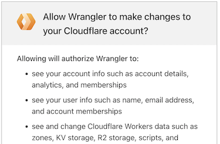
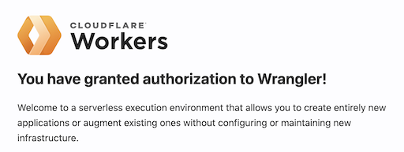

<!--
Snippet that may be useful, **if** there is a case for `wrangler login`. Turns out, deployments didn't need it!
-->

In order to deploy, we finally need to attach to your Cloudflare account.

### `wrangler login`

First, pass the port 8976 from VM to the host (so your browser will find it).

```
$ {path-to-mp}/web+cf/login-fwd.sh 
*
* Going to forward the port '192.168.64.105:8976' as 'localhost:8976' so the dance can begin.
*
* This will require a 'sudo' pw next.
*
Press a key to continue...
Password:
Warning: Permanently added '192.168.64.105' (ED25519) to the list of known hosts.
*
* Port is now forwarded.
* Please
*   - run 'wrangler login --browser=false' in the VM
*   - open the provided link in a browser you use with Cloudflare
*   - sign in
*
* Once the CLI is happy (you may try 'wrangler whoami'), press a key and we'll close the port forward.
*
Press a key once login dance is over...
```

Within the VM:

```
$ wrangler login --browser=false

 ⛅️ wrangler 3.60.2
-------------------

Attempting to login via OAuth...
Visit this link to authenticate: https://dash.cloudflare.com/oauth2/auth?response_type=code&client_id=54d11594-...
```

- Open the link (hint: to open in macOS default browser, `Cmd-double-click` it)

- In the browser:

   - Read and press `Allow`:

   >
   
   <p />
   
   >

`wrangler` CLI is now connected to the cloud.

Press a key on the host, to close the port forward.

>Note: If the `wrangler login` times out, just try again!

---

>Hint: You can check your identity by:
>
>```
>$ wrangler whoami
>...
>```

---
